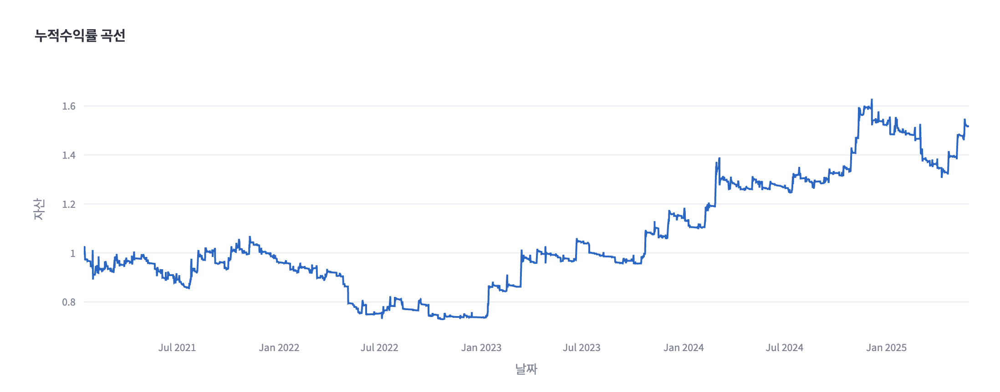

# Crypto Trading Backtest & Forwardtest System

This project is a robust system for backtesting and forward testing cryptocurrency trading strategies, with visualization and analysis of results. Data is automatically fetched from CCXT, mcp, etc. Strategies can be registered/modified/deleted as Python functions. The system provides key performance metrics and professional-style reports used by crypto quant firms.

## Main Features
- Automatic exchange data download (CCXT, mcp)
- Strategy registration/modification/deletion (Python function-based)
- Backtest/forward test engine (Backtrader/Backtesting.py)
- Performance metrics: cumulative return, annual return, annualized return, MDD, Sharpe, volatility, etc.
- Visualization: cumulative return graph, annual bar chart, drawdown, heatmap, etc.
- Streamlit web UI: select strategy, input parameters, view report/graphs

## Folder Structure
```
/data         # Price data storage
/strategies   # Python files for trading strategies
/backtest     # Backtest/forward test engine
/report       # Report/visualization code
app.py        # Streamlit main app
```

## Installation & Usage
```bash
# Install dependencies
pip install -r requirements.txt

# Run Streamlit app
streamlit run app.py
```

## Example Screenshots

Below are example screenshots of the actual system.





## Main Dependencies
- pandas
- numpy
- ccxt
- backtrader
- backtesting
- empyrical
- pyfolio
- streamlit
- plotly
- matplotlib
- pytest
- black
- flake8
- (mcp: install separately if needed)

## Contribution
- PRs/issues are welcome
- Feel free to suggest or add strategies/indicators/visualizations
# VibeCrypto

## License
This project is distributed under the GNU General Public License (GPL).
